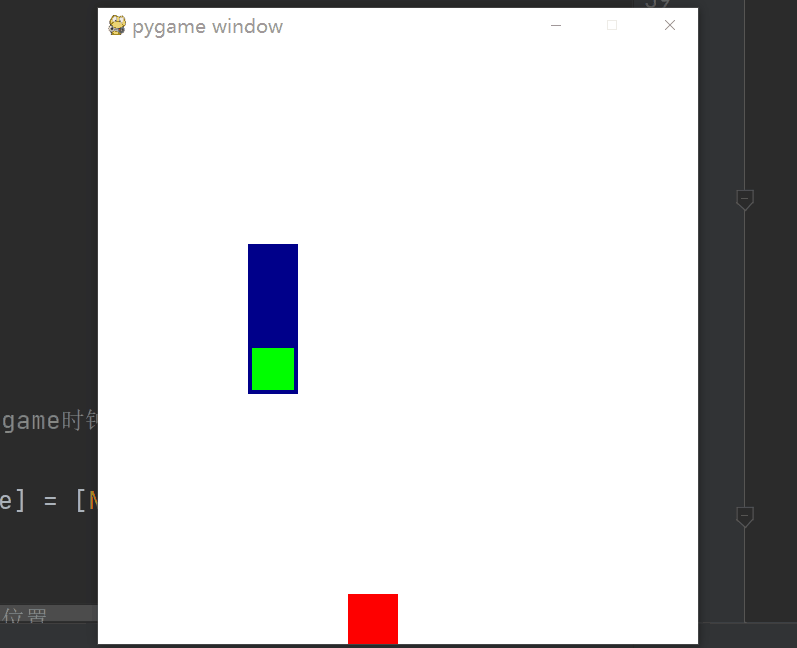

# DRL4SnakeGame

 Using deep reinforcement learning to play Snake game(贪吃蛇).

The used algorithm is PPO for discrete! It has the brilliant performance in the field of discrete action space just like in continuous action space.

You just need half an hour to train the snake and then it can be as smart as you.

## Result

## File to Illustrate

Agent.py: file to store the algorithm.

core.py: file to store the net for DRL algorithm.

draw.py: file to draw the reward curve.

env4Snake.py: the environment for snake game.

main.py: the main func.

**what you need to do is to run the main.py and then run the env4Snake to test your mdoel!**

## Details for realization

See my blog for details: https://blog.csdn.net/weixin_43145941/article/details/118639211

